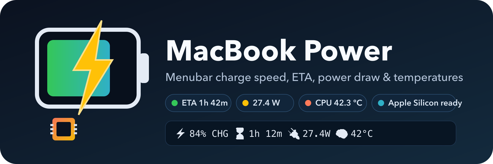

<p align="center">
	
</p>

<p align="center">
	macOS menubar battery monitor with live charge speed, ETA, real system power draw, and CPU/battery temperatures.
</p>

## Highlights

- Live percentage, charge speed, ETA, and **real system power draw** (from `PowerTelemetryData`) in the menu bar
- **Apple Silicon CPU temperature** via `smctemp` (M1+), with auto-install button
- Battery temperature from built-in AppleSmartBattery telemetry
- Transparent template icon that matches light/dark menu bars
- Checkbox-configurable title modules (state, time, power, temps, icons, °C/°F)
- No-icon mode uses labeled tokens for readability (for example `ETA:15m | PWR:7.1W`)
- **Menu stays open** when toggling options — tweak several settings without reopening
- Python package setup with tests, linting, and VS Code debug tasks
- GitHub Actions CI and automatic release workflow

## Configurable display options

All title components can be toggled on/off via menu checkboxes. The menu
re-opens automatically after each toggle so you can tweak several settings in
a single session.

- **Charge State** (CHG / BAT / AC / FULL) – charging status and external power indicator
- **Remaining Time** (ETA) – time to full charge or battery drain
- **Power Draw** (watts) – real system power from `PowerTelemetryData.SystemPowerIn`
  (non-zero even at 100 %), with fallback to battery flow
- **Battery Temperature** – battery pack temperature in °C/°F (always available)
- **CPU Temperature** – processor package temperature (optional, see below)
- **Per-Metric Icons** – use symbols (⚡🔌🔋) instead of text labels
- **Use Fahrenheit** – switch temperature unit globally

## CPU Temperature (optional)

Battery temperature is read from built-in macOS APIs via `ioreg`. However, CPU temperature requires third-party tools since macOS does not expose this data through standard APIs.

**To enable CPU temperature display:**

1. Enable the "🧠 CPU temperature" toggle in the app menu
2. If the tool is not installed, an "⬇ Install CPU temperature tool" button will appear
3. Click the button to auto-install via Homebrew (requires Homebrew to be installed)
4. Alternatively, install manually via Homebrew:

```bash
# Recommended: smctemp (works on Apple Silicon and Intel)
brew install narugit/tap/smctemp

# Intel Macs only (return 0.0 on Apple Silicon):
brew install osx-cpu-temp
brew install istats
```

After installation, restart the widget and enable CPU temperature in the menu settings.

If no working tool is installed, CPU temperature will display as `--` (disabled in UI).
On Apple Silicon Macs (M1+), only `smctemp` reports real values — `osx-cpu-temp`
and `istats` rely on Intel-era SMC keys.

## Project visuals

- Brand hero (PNG, for GitHub social): [assets/branding/logo.png](assets/branding/logo.png)
- Brand hero (SVG source): [assets/branding/logo.svg](assets/branding/logo.svg)
- Brand mark (PNG): [assets/branding/logo-mark.png](assets/branding/logo-mark.png)
- Brand mark (SVG source): [assets/branding/logo-mark.svg](assets/branding/logo-mark.svg)
- Menubar runtime icon: [assets/icons/menubar-template.png](assets/icons/menubar-template.png)
- Additional icon pack: [assets/icons](assets/icons)

To re-render the PNGs from SVG after editing (requires `brew install librsvg`):

```bash
rsvg-convert -w 1920 -h 640 assets/branding/logo.svg -o assets/branding/logo.png
rsvg-convert -w 640  -h 640 assets/branding/logo-mark.svg -o assets/branding/logo-mark.png
```

## Quick start

```bash
./.scripts/setup_project.sh
source .venv/bin/activate
macbook-power-widget
```

## Development commands

```bash
source .venv/bin/activate
python -m macbook_power.main --once
pytest -q
ruff check .
```

## Build and distribute

Create wheel and source distribution locally:

```bash
bash .scripts/build_dist.sh
```

Artifacts are written to dist.

## GitHub automation

CI workflow:

- [.github/workflows/ci.yml](.github/workflows/ci.yml)
- Runs tests and lint on push and pull requests

Release workflow:

- [.github/workflows/release.yml](.github/workflows/release.yml)
- Triggered when you push a tag matching v*
- Builds Python distributions and publishes a GitHub Release with attached artifacts

Example release flow:

```bash
git tag v0.1.0
git push origin v0.1.0
```

## Icon pipeline

SVG files are kept for design and future tooling. PNG files are generated for runtime and packaging compatibility.

Regenerate PNG assets:

```bash
source .venv/bin/activate
python .scripts/generate_icons.py
```

## App Store direction

This repository is a strong prototype for telemetry logic, UX, and release mechanics.

For Mac App Store distribution later, the practical path is:

1. Keep this repo as behavior reference and test bed.
2. Build a native SwiftUI shell for notarization and App Store rules.
3. Port matching battery logic and validate against this project outputs.
